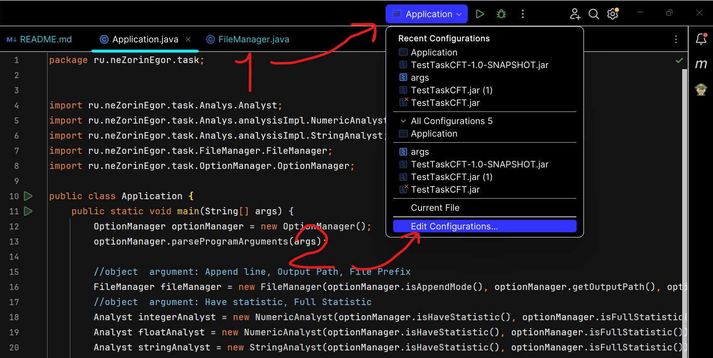
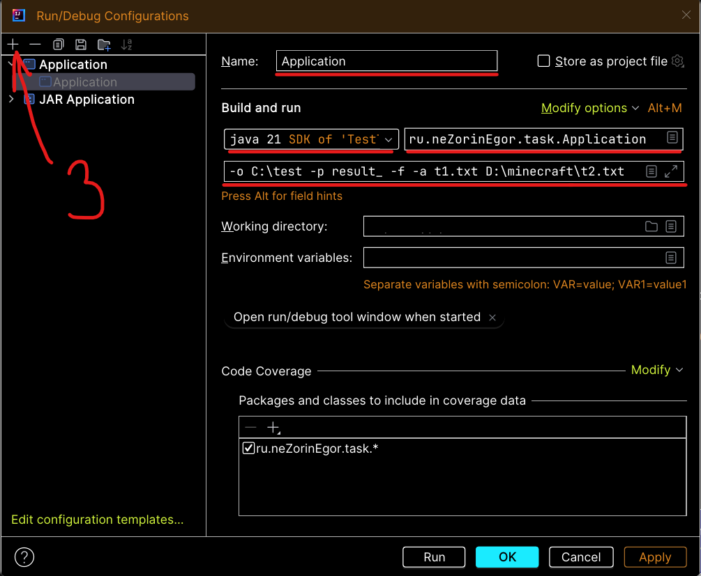

# Утилита фильтрации содержимого файлов.

## Задача
Задача утилиты записать разные типы данных в разные файлы. Целые числа в один
выходной файл, вещественные в другой, строки в третий. По умолчанию файлы с
результатами располагаются в текущей папке с именами integers.txt, floats.txt, strings.txt.
## Дополнительные опции
| Дополнительные опции | Описание                                                        |
|----------------------|-----------------------------------------------------------------|
| -o                   | Задать путь к результату                                        |
| -p                   | Префикс к названию файла                                        |                  
| -a                   | Добавления в существующие файлы (по умолчанию перезаписываются) |                  
| -s                   | Краткая статистика                                              |                  
| -f                   | Полная статистика                                               |  

Пример: ```-o /some/path -p sample_ -a -f t1.txt t2.txt```

## Описание классов
Все классы находятся в пакете **ru.neZorinEgor.task**.

| Наименование класса/интерфейса | Описание                                                                                                                 |
|--------------------------------|--------------------------------------------------------------------------------------------------------------------------|
| OptionManager                  | Сущность, которая обрабатывает программные аргументы и передает информацию для поведения Аналитику и Файловому менеджеру |
| FileManager                    | Сущность, работающая с файлами: создает, фильтрует, удаляет и передает аналитику                                         |
| Analyst                        | Интерфейс, описывающий, что должен делать аналитик                                                                       |
| NumericAnalyst                 | Реализация интерфейса Analyst. Корректно анализирует числовые и с плавающей точкой файлы                                 |
| StringAnalyst                  | Реализация интерфейса Analyst. Корректно анализирует строковые файлы                                                     |
| Application                    | Основной класс приложения с методом main(String[] args)                                                                  |

## Настройка окружения
Для настройки окружения следует выполнить следующие шаги:

1. Установить дистрибутив Java 17 или выше так, чтобы он запускался по умолчанию.
 Так же установить maven
    ```bash 
    sudo apt install openjdk-17-jdk
    ``` 
   ```bash 
    sudo apt install maven
    ```
2. Копировать репозиторий в пустой каталог.
    ```bash 
    git clone https://github.com/NeZorinEgor/File-Filter.git
    ```

## Запуск приложения

### Запуск приложения через InteleJ Idea
В клонированном проекте в настройки конфигурации запуска

В нем создайте конфигурацию Application 
В конфигурации задайте:
1. Имя
2. Версию JDK 
3. Main class - ru.neZorinEgor.task.Application
4. Program argument (например -a -f -s -o <path> -p <prefix> <file.txt> и тп...)


### Запуск приложения, собранного Apache Maven
1. `cd File-Filter`
2. `mvn clean package`
3. `java -jar target/TestTaskCFT-1.0-SNAPSHOT.jar <набор опций и файлов>`

### Пример 

```bash
java -jar target/TestTaskCFT-1.0-SNAPSHOT.jar -o C:\test -p result_ -f -a t1.txt D:\minecraft\t2.txt
```
### Результат выполнения
```
Statistics for: result_integers.txt
└─ Number of elements: 3
        └─ Additional details:
                ├─── Minimum: 45
                ├─── Maximum: 1234567939550609410
                ├──── Amount: 1234567939550710020
                └─── Average: 411522646516903360

Statistics for: result_floats.txt
└─ Number of elements: 3
        └─ Additional details:
                ├─── Minimum: -0,0000099999997474
                ├─── Maximum: 3,1414999961853027
                ├──── Amount: 3,1414899961855554
                └─── Average: 1,0471633320618519

Statistics for: result_strings.txt
└─ Number of elements: 6
        └─ Additional details:
                ├─── Minimum length: 4.0
                └─── Maximum length: 42.0
```

```bash
~/java/filter/test_output$ ls
result_floats.txt  result_integers.txt  result_strings.txt

~/java/filter/test_output$ tail -f result_floats.txt
3.1415
-0.00001
1.528535047E-25


~/java/filter/test_output$ tail -f result_integers.txt
45
100500
1234567890123456789


~/java/filter/test_output$ tail -f result_strings.txt
Lorem ipsum dolor sit amet
Пример
consectetur adipiscing
тестовое задание
Нормальная форма числа с плавающей запятой
Long
```

### Обработка ошибок
Ввод несуществующей опции:
```
PS D:\java-app\junior\TestTaskCFT> java -jar target/TestTaskCFT-1.0-SNAPSHOT.jar -o C:\test -p result_ -f?  t1.txt t2.txt

>>> Error!!! Unknown option: -f?
┌────────────────────────────   Message:   ───────────────────────────┐
| Please make sure you have entered the correct options and try again |
└─────────────────────────────────────────────────────────────────────┘
```
Ввод несущего входного файла:
```
PS D:\java-app\junior\TestTaskCFT> java -jar target/TestTaskCFT-1.0-SNAPSHOT.jar -o C:\test -p result_ -f  ast1.txt t2.txt

>>> Error!!! File not found: ast1.txt (Не удается найти указанный файл)
┌────────────────────────────   Message:   ───────────────────────────┐
| Please make sure you entered the correct file name and try again    |
└─────────────────────────────────────────────────────────────────────┘
```
Ввод несущего выходного пути:
```
PS D:\java-app\junior\TestTaskCFT> java -jar target/TestTaskCFT-1.0-SNAPSHOT.jar -o C:\teest -p result_ -f  t1.txt t2.txt

>>> Error!!! Cannot find the specified path: C:\teest\result_integers.txt (Системе не удается найти указанный путь)
┌────────────────────────────   Message:   ────────────────────────┐
| Please make sure you have entered the correct path and try again |
└──────────────────────────────────────────────────────────────────┘
PS D:\java-app\junior\TestTaskCFT> 
```
